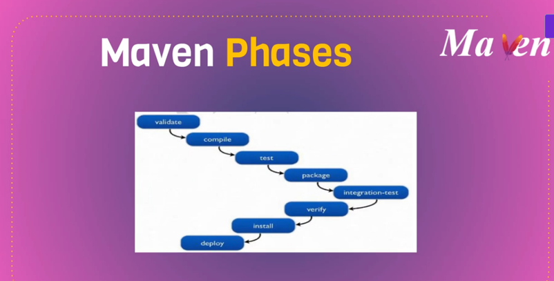

# Maven --> build tool

### Maven phases




### Maven build life cycle
https://maven.apache.org/guides/introduction/introduction-to-the-lifecycle.html

### Maven hands-on

* First have a ubuntu VM (can use any OS but need to have the right version of maven)
* login to server and switch to root user (for this practice)
```
sudo -i
```
* Need to install Maven which need JDK (Java development kit). So, first install JDK (can use v17 and v21 for vprofile)
> Note: In Jave, we often hear about JRE (Java runtime environment) and JDK (Java development kit). To build the project we need JDK

```
apt update
```
* Search for JDK (or for the required package)
```
apt search jdk
```
> can filter for a specific version
```
apt search jdk | grep 17
```
> in the list look for 'opnejdk-<version>-jdk

* [_Different java versions_](#different-java-versions) (JDKs) can be installed and can switch between them as per the requirement


```
apt install openjdk-<version>-jdk -y
```
> eg: apt install openjdk-21-jdk -y

* To check the version
```
java -version
```
* Install Maven
```
apt install maven -y
```
> [_Different maven versions_](#different-maven-versions) can also be installed but it is not so straight forward as java, we need to download the binaries, unzip and use it.


* check the version
```
mvn -version
```
> vprofile work on any version of Maven (in practice -- 3.8.x) and java (jdk 17 or 21). But in real time we need to get the specific versions

* Clone the source code
```
git clone https://github.com/hkhcoder/vprofile-project.git
```
```
ls
```
```
cd vprofile-project
```
```
ls
```
> check if the folder has 'pom.xml' and 'src' folder

> Also check the current branch is 'local'
```
git status
```
>if not 'local', change it to local by running the below 2 commands, otherwise skip these 2

>list all the branches and switch to the desired branch
```
git branch -a
```
```
git checkout <branch name>
```

* Validate the directory structure
```
mvn validate
```
> should see BUILD SUCCESS

> all mvn commands read the information from pom.xml

> build tools have the capacity to run the test cases written by developers which are called unit tests. For java, we can see 'junit' (in pom.xml) test cases which can be run by running the below command

* Execute the unit test cases written by developers
```
mvn test
```
> this will generate a report in 'target' folder

```
ls
```
>should see 'target' folder

* build the code
```
mvn install
```

> it will download all the dependencies specified in pom.xml and all these will be downloaded to '<home directory>/.m2/repository'. We can/need to remove them if required, for example, when changing the maven version or dependencies,..etc. All the dependencies will be downloaded again when we run 'mvn install' or 'mvn clean install'

> If it is root user '~/.m2/repository'
```
rm -rf ~/.m2/repository/*
```
can also remove the 'target' folder
```
rm -rf target
```
can also use 
```
mvn clean install
```
> this will only remove the 'target' folder but not the dependencies

### troubleshooting some errors while building

* When we run 'mvn intall' sometimes we may get the error of not able to create 'war' file due to 'java heap space' which means low resource.

> when we try to build the code, java will create a VM (JVM) in the OS which will do all the build process. JVM also need some resource. So, to address this we can set the environment variable of resource for maven so that it think it has the enough resource while building.
```
export MAVEN_OPTS="-Xmx1024m"
```
> now run the 'mvn install' again

* Lets try to create other error.

    - first remove the 'target' and 'repository' folders
```
rm -rf target

rm -rf ~/.m2/repository/*
```
    - open the pom.xml
```  
'vim pom.xml'
```
> search for 'jacoco'
```
/jacoco
```
> change the version from '0.8.9' to '0.8.8'
```
:wq
```
> Now run 'mvn install'. Build might get success but can see error while instrumenting ****** with jacoco (compatibility issue of jacoco version with java 21 used for this)


### Using different versions of Maven and Java

#### Different java versions

* Install the required JDK versions
```
apt install <jdk> -y
```

> eg: apt install openjdk-21-jdk -y

> eg: apt install openjdk-17-jdk -y

* To switch between the java versions use the below command and enter the selection number

```
sudo update-alternatives --config java'
```

#### Different maven versions

> To have mulitple maven version it is not so straight forward as java, we need to download the binaries, unzip and use it
'https://archive.apache.org/dist/maven/maven-3/'

```
cd /tmp
```

```
wget <zip file link>
```

> eg: wget https://archive.apache.org/dist/maven/maven-3/3.9.9/binaries/apache-maven-3.9.9-bin.tar.gz

```
ls /tmp/
```

* unzip the tar.gz file 
```
tar -xzvf <.tar.gz file>
```

```
mv <unzipped folder> /usr/local/bin/<mavenversion>
```

```
ls /usr/local/bin/<mavenversion>/
```
>should see 'bin' folder in which we have the 'mvn' command for the downloaded version

* Check the other version of the maven downloaded
```
/usr/local/bin/<mavenversion>/bin/mvn -version
```

* To use this version to build the code 
```
/usr/local/bin/<mavenversion>/bin/mvn install
```
> if we don't use the complete path it will use the default version of maven


### Building in AWS Cloud Shell

```
cat /etc/os-release
```
> if it is Amazon-linux, it is based on 'rpm' -- we can use 'yum' or 'dnf'

```
sudo dnf search java | grep 21
```
> in ubuntu package name is JDK but in rpm it is 'java'

```
sudo dnf install <java-21-xxx> -y
```

```
sudo dnf install maven -y
```

```
git clone https://github.com/hkhcoder/vprofile-project.git
```

```
ls
```
```
cd vprofile-project
```
```
mvn install
```