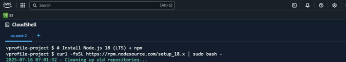

* Install NodeJS in AWS Cloud shell
> can get the command for specific verison, here we used NodeJS 18



```
curl -fsSL https://rpm.nodesource.com/18.x | sudo bash -
```
```
sudo yum install -y nodejs
```

> For NodeJS we have 'node' (like jdk in java) and 'npm' (like maven for java)
* Verify the installation
```
node -v
```
```
npm -v
```
* Clone the source code and change to the project directory
```
git clone https://github.com/hkhcoder/emartnode.git
```

```
cd emartnode
```
* Build the code
```
npm install
```
> This reads the 'package.json' file and install all the libraries into the 'node_modules' folder

* If the source code has any package-lock.json 'npm install' detects the vulnerabilites and need to run the below command to fix it
```
npm audit fix
```
* check for any other vulnerabilities
```
npm audit
```

> npm also has a cache directory in the home directory
```
ls -a ~/.npm/
```